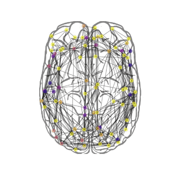

# neurolib
*Easy whole-brain neural mass modeling 👩‍🔬💻🧠*

Neurolib allows you to easily create your own state-of-the-art whole-brain models. The main implementation is a neural mass firing rate model called `aln` which consists of two populations of excitatory and a inhibitory neurons. This `aln` model is a mean-field model of spiking adaptive exponential integrate-and-fire neurons (AdEx). An extensive study and analysis of the model can be found in the [stimulus\_neural\_populations](https://github.com/caglarcakan/stimulus_neural_populations) project's github page and in the associated paper.

# Whole-brain modeling

In combination with structural brain data, for example from diffusion tensor imaging (DTI) [tractography](https://en.wikipedia.org/wiki/Tractography), and resting state [BOLD](https://en.wikipedia.org/wiki/Blood-oxygen-level-dependent_imaging) data from magnetic resonance imaging (rs-fMRI), a network model of a whole brain can be created. Structural connectivity matrices from DTI tractography define 1) the connection strengths between areas, representing for example by the number of axonal fibers between each brain area and 2) the signal transmission delays between brain areas, as measured from the length of the axonal fibers. 

The resulting whole-brain model consists of interconnected brain areas, with each brain area having their internal neural dynamics. The neural activity is used to simulate BOLD activity using the Balloon-Windkessel model. The resulting simulated [resting state functional connectivity](https://en.wikipedia.org/wiki/Resting_state_fMRI#Functional) can then be used to fit the model to empirical functional brain data. 

Below is an animation in which the neural activity is plotted on the brain network for visualisation.

<p align="center">
  
</p>

## Usage
Example iPython notebooks on how to use the library can be found in the `./examples/` directory. A basic overview is given here. 

### Single node
To run a single node with the default parameters, simply run

```python
from neurolib.models import aln

alnModel = aln.ALNModel()
alnModel.params['sigma_ou'] = 0.1 # add some noise

alnModel.run()
```

The results of this small simulation can be plotted easily

```python
import matplotlib.pyplot as plt
plt.plot(alnModel.t, alnModel.rates_exc.T)

```
<p align="left">
  
</p>

### Whole-brain network

To simulate a whole-brain network model, first we need to load a DTI and a resting-state fMRI dataset (which is provided in the `./data/datasets/` directory of this repository).

```python
from neurolib.utils.loadData import Dataset

ds = Dataset("gw")
```
The dataset that we just loaded, looks like this:

<p align="center">
  
</p>

We can now initialise the model with the dataset:

```python
alnModel = aln.ALNModel(Cmat = ds.Cmat, Dmat = ds.Dmat, simulateBOLD=True)
alnModel.params['duration'] = 5*60*1000 # in ms, simulates for 5 minutes

alnModel.run()
```
Note that the above specified `simulateBOLD=True`, which simulates a BOLD model in parallel to the rate model. The resulting firing rates and BOLD functional connectivity looks like this:
<p align="center">
  
</p>

The fit of the simulation to the empirical data can now be computed per subject or for the whole group on average:

```python
scores = []
for i in range(len(ds.FCs)):
    fc_score = func.matrix_correlation(func.fc(alnModel.BOLD[:, 5:]), ds.FCs[i]) 
    scores.append(fc_score)
    print("Subject {}: {:.2f}". format(i, fc_score))
print("Mean simulated FC to empirical FC correlation: {:.2f}".format(np.mean(scores)))
```
```
Subject 0: 0.71
Subject 1: 0.70
Subject 2: 0.52
Subject 3: 0.56
Subject 4: 0.51
Subject 5: 0.60
Subject 6: 0.64
Subject 7: 0.65
Subject 8: 0.36
Subject 9: 0.54
Subject 10: 0.49
Mean simulated FC to empirical FC correlation: 0.57
```

