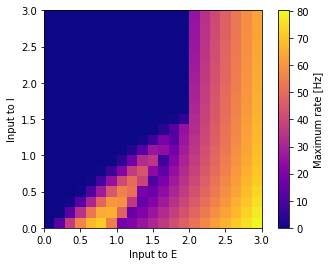
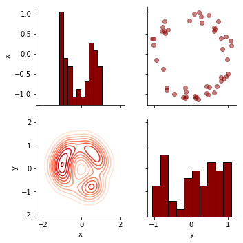

   [](https://codecov.io/gh/neurolib-dev/neurolib) [](https://pypi.python.org/pypi/neurolib/) [](https://github.com/psf/black)

# Neurolib
*Easy whole-brain neural mass modeling* 👩‍🔬💻🧠

`Neurolib` allows you to easily create your own state-of-the-art whole-brain models. The main implementation is a neural mass firing rate model of spiking adaptive exponential integrate-and-fire neurons (AdEx) called `aln` which consists of two populations of excitatory and inhibitory neurons. 

An extensive analysis of this model can be found in our paper and its associated [github page](https://github.com/caglarcakan/stimulus_neural_populations).

**Reference:** Cakan, C., Obermayer, K. (2020). Biophysically grounded mean-field models of neural populations under electrical stimulation ([ArXiv](https://arxiv.org/abs/1906.00676)).

<p align="center">
  
</p>

<p style="text-align: center;"> 
<br>
<b> Quick examples:
<a href="#single-node">Single node simulation</a> 
<a href="#whole-brain-network">Whole-brain network</a>
<a href="#parameter-exploration">Parameter exploration</a>
<a href="#evolutionary-optimization">Evolutionary optimization</a>
</b>
<br>
</p>

## Whole-brain modeling

In combination with structural brain data, for example from diffusion tensor imaging (DTI) [tractography](https://en.wikipedia.org/wiki/Tractography), and functional resting state [BOLD](https://en.wikipedia.org/wiki/Blood-oxygen-level-dependent_imaging) time series data from magnetic resonance imaging (rs-fMRI), a network model of a whole brain can be created. Structural connectivity matrices from DTI tractography define 1) the connection strengths between areas, represented for example by the number of axonal fibers between each two brain areas and 2) the signal transmission delays measured from the length of the axonal fibers. 

The resulting whole-brain model consists of interconnected brain areas, with each brain area having their internal neural dynamics. The neural activity is used to simulate BOLD activity using the Balloon-Windkessel model. The resulting simulated [resting state functional connectivity](https://en.wikipedia.org/wiki/Resting_state_fMRI#Functional) can then be used to fit the model to empirical functional brain data. 

Below is an animation in which the neural activity from such a model is plotted on a brain network for visualisation.

<p align="center">
  
</p>

# Installation
The easiest way to get going is to install the pypi release of `neurolib` using

```
pip install neurolib
```
Alternatively, you can also clone this repository and install all dependencies with

```
git clone https://github.com/neurolib-dev/neurolib.git
cd neurolib/
pip install -r requirements.txt
pip install .
```

# Usage
Example [IPython Notebooks](examples/) on how to use the library can be found in the `./examples/` directory, don't forget to check them out! A basic overview of the functionality that `Neurolib` provides is given here. 

## Single node

A detailed example is available as a [IPython Notebook](examples/example-0-aln-minimal.ipynb). 

To create a single `aln` model with the default parameters, simply run

```python
from neurolib.models.aln import ALNModel

aln = ALNModel()
aln.params['sigma_ou'] = 0.1 # add some noise

aln.run()
```

The results from this small simulation can be plotted easily:

```python
import matplotlib.pyplot as plt
plt.plot(aln.t, aln.rates_exc.T)

```
<p align="left">
  
</p>

## Whole-brain network

A detailed example is available as a [IPython Notebook](examples/example-0-aln-minimal.ipynb). 

To simulate a whole-brain network model, first we need to load a DTI and a resting-state fMRI dataset (an example dataset called `gw` is provided in the `neurolib/data/datasets/` directory).

```python
from neurolib.utils.loadData import Dataset

ds = Dataset("gw")
```
The dataset that we just loaded, looks like this:

<p align="center">
  
</p>

We can now initialise the model with the dataset:

```python
aln = ALNModel(Cmat = ds.Cmat, Dmat = ds.Dmat, simulateBOLD=True)
aln.params['duration'] = 5*60*1000 # in ms, simulates for 5 minutes

aln.run()
```
This can take several minutes to compute, since we are simulating 90 nodes for 5 minutes realtime. Here, we have created a network model in which each brain area is an `aln` node. Note that we specified `simulateBOLD=True`, which simulates the BOLD model in parallel to the firing rate model. The resulting firing rates and BOLD functional connectivity looks like this:
<p align="center">
  
</p>

The quality of the fit of this simulation can be computed by correlating the simulated functional connectivity matrix above to the empirical resting-state functional connectivity for each subject. This gives us an estimate of how well the model reproduces inter-areal BOLD correlations. As a rule of thumb, a value above 0.5 is considered good. 

We can compute this by using the builtin functions `func.fc` to calculate a functional connectivity from `N` (`N` = number of regions) time series and and `fund.matrix_correlation` to compare this to the empirical data.

```python
scores = []
for i in range(len(ds.FCs)):
    fc_score = func.matrix_correlation(func.fc(alnModel.BOLD[:, 5:]), ds.FCs[i]) 
    scores.append(fc_score)
    print("Subject {}: {:.2f}". format(i, fc_score))
print("Mean simulated FC to empirical FC correlation: {:.2f}".format(np.mean(scores)))
```
```
Subject 0: 0.71
Subject 1: 0.70
Subject 2: 0.52
Subject 3: 0.56
Subject 4: 0.51
Subject 5: 0.60
Subject 6: 0.64
Subject 7: 0.65
Subject 8: 0.36
Subject 9: 0.54
Subject 10: 0.49
Mean simulated FC to empirical FC correlation: 0.57
```
## Parameter exploration
A detailed example is available as a [IPython Notebook](examples/example-1-aln-parameter-exploration.ipynb). 

Whenever you work with a model, it is of great importance to know what kind of dynamics it exhibits given a certain set of parameter. For this, it is useful to get an overview of the state space of a given model. For example in the case of `aln`, the dynamics depends a lot on the mean inputs to the excitatory and the inhibitory population. `Neurolib` makes it very easy to quickly explore parameter spaces of a given model:

```python
# create model
aln = ALNModel()
# define the parameter space to explore
parameters = {'mue_ext_mean' : np.linspace(0, 3, 11).tolist(),
              'mui_ext_mean' : np.linspace(0, 3, 11).tolist()}       

# define exploration              
search = BoxSearch(aln, parameters)
search.initializeExploration()
search.run()                
```
That's it!. You can now use the builtin functionality to read the simulation results from disk and do your analysis:

```python
search.loadResults()

# calculate maximum firing rate for each parameter
for i in search.dfResults.index:
    search.dfResults.loc[i, 'max_r'] = np.max(search.results[i]['rates_exc'][:, -int(1000/aln.params['dt']):])
```
We can plot the results to get something close to a bifurcation diagram!

<p align="center">
  
</p>

## Evolutionary optimization

A detailed example is available as a [IPython Notebook](examples/example-2-evolutionary-optimization-minimal.ipynb). 

`Neurolib` also implements evolutionary parameter optimization, which works particularly well with brain networks. In an evolutionary algorithm, each simulation is represented as an individual. An individual is a part of a population. In each generation, individuals are evaluated according to a fitness criterion. Afterwards, all individuals of a population which have a high fitness value are able to mate and create offspring. This offspring undergoes some random changes, which is often called mutation. Then all offsprings are evaluated and the best part of the population is selected. This process goes on for a given amount generations until a good population with high-fitness individuals is found.

`Neurolib` makes it very easy to set up your own evolutionary optimization and everything else is handled under the hood. In this example, we will simply calculate the example of each individual as the distance to the unit circle. 

```python
from neurolib.utils.parameterSpace import ParameterSpace
from neurolib.optimize.evolution import Evolution

def optimize_me(traj):
    ind = evolution.getIndividualFromTraj(traj)
    
    # let's make a circle
    fitness_result = abs((ind.x**2 + ind.y**2) - 1)
    
    # gather results
    fitness_tuple = (fitness_result ,)
    result_dict = {"result" : [fitness_result]}
    
    return fitness_tuple, result_dict
```

That's it! Now you can check the results!

```python
evolution.loadResults()
evolution.info(plot=True)
```
which will give you a summary of the last generation and plot a distribution of the individuals (and their parameters). As you can see in the parameter space cross sections below, all remaining individuals lie on a circle.

<p align="center">
  
</p>